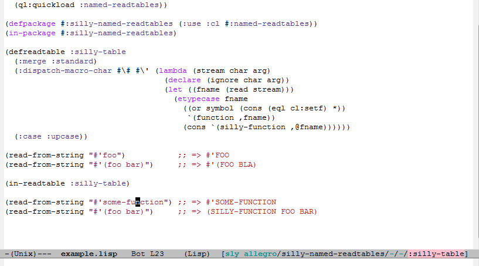

# NAMED-READTABLES support for SLY

`sly-named-readtables` is an external contrib for [SLY][sly] that enables
different readtables to be active in different parts of the same file:



Based on the original idea and implementation by user "budden"
discussed in https://github.com/slime/slime/pull/259.

## Install from MELPA

Give me some time to set this up

## Melpa-less install

This should work fine:

```elisp
;;; regular SLY setup
(setq inferior-lisp-program "/path/to/your/preferred/lisp")
(add-to-list 'load-path "/path/to/sly")
(require 'sly-autoloads)

(add-to-list 'load-path "/path/to/sly-named-readtables")
(require 'sly-named-readtables-autoloads)
```

In case you already have SLY loaded and running, you might have to
`M-x sly-setup` and `M-x sly-enable-contrib` to enable it.

`sly-named-readtables` should now kick in in Lisp buffers. You must
have `named-readtables` setup in your Lisp before it takes any actual
effect though. That's easy, just `(ql:quickload :named-readtables)`.

[sly]: https://github.com/capitaomorte/sly


